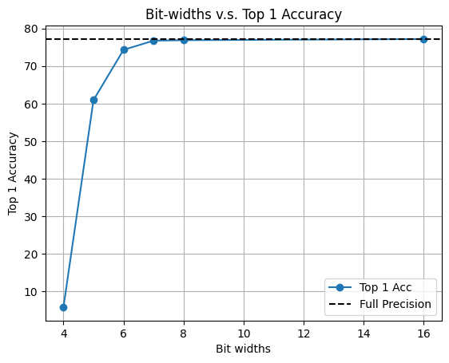
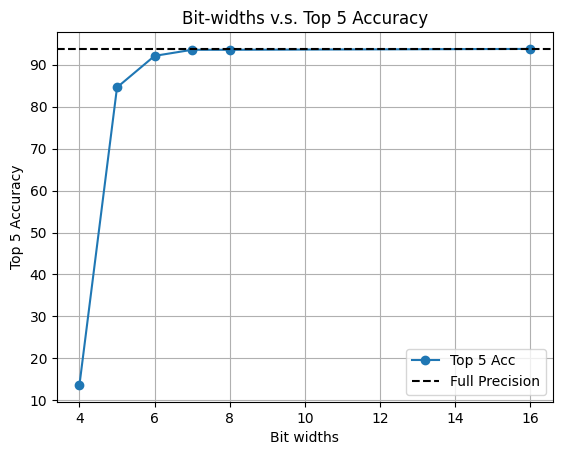

The readme file for the original FQ-ViT is renamed as README_FQViT.md. All the modified code is in test_quant.py and mobilevit_quant.py.

# MobileViT with Quantized Conv2D & MLP

**MobileViT(https://huggingface.co/apple/mobilevit-small)**

## Accuracy v.s. Bit-widths test results on ImageNet

  

  

## Storage and Computation comparison

The full-precision mobilevit takes 21.328 MB of storage, while the signed 8-bit mobilevit only takes 5.464MB of storage.

Moreover, while the full-precision mobilevit takes 2 GMacs, the signed 8-bit mobilevit only takes 900 MMacs.

However, the signed 8-bit mobilevit's inference time is twice as long as full-precision mobilevit's inference time, possibly due to the calculation of min and max value by the minmax observer.
